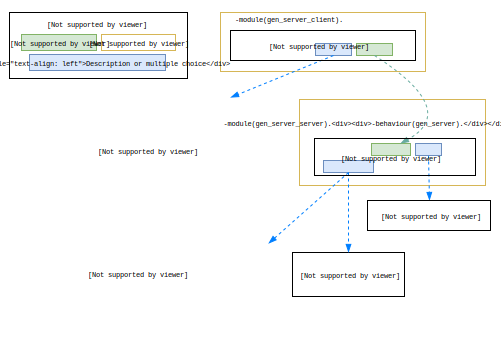

# OTP CheatSheet

###### [Credits to: https://github.com/Telichkin/otp_cheatsheet]

Every OTP behavior has main parts in its API: client, server, possible inputs and possible outputs. But a one-dimensional structure of standard documentation (from top to bottom) can't present all these parts in one place which leads to loss of a context and longer learn-curve.

This cheat sheet is an attempt to present common parts of OTP behaviors in one place using opportunities of a two-dimensional structure.

## Table of Contents
- Supervisor
  - Init
- Gen Server
  - Init
  - Sync operation
  - Async operation
  - Info message
  - Terminate

## Supervisor
#### Init

## Gen Server
#### Init

#### Sync operation

#### Async operation

#### Info message

#### Terminate

